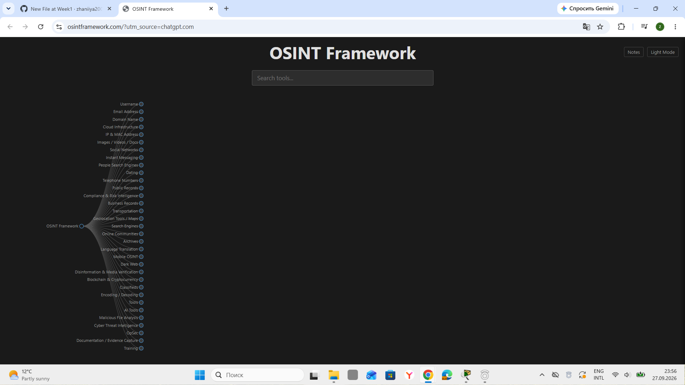
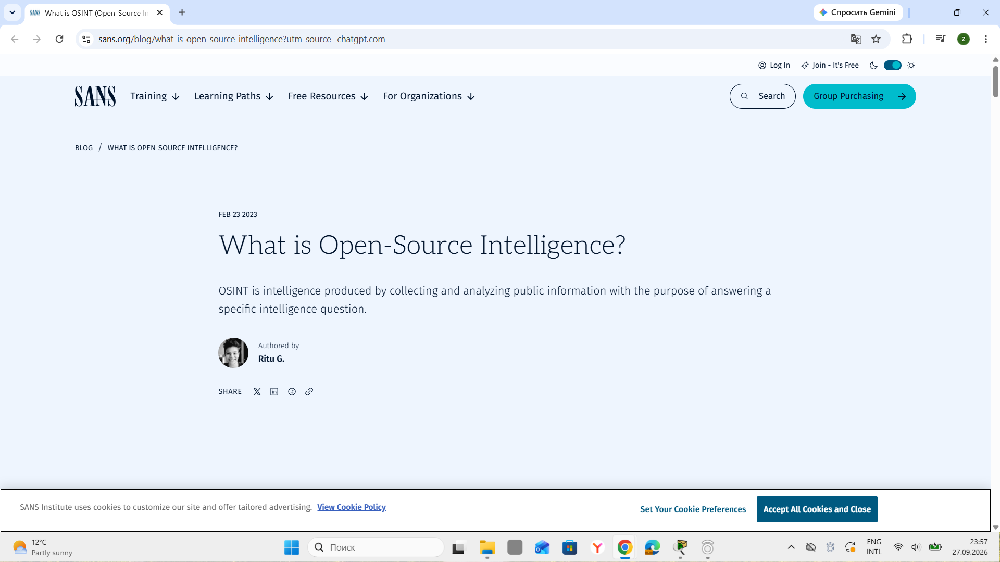
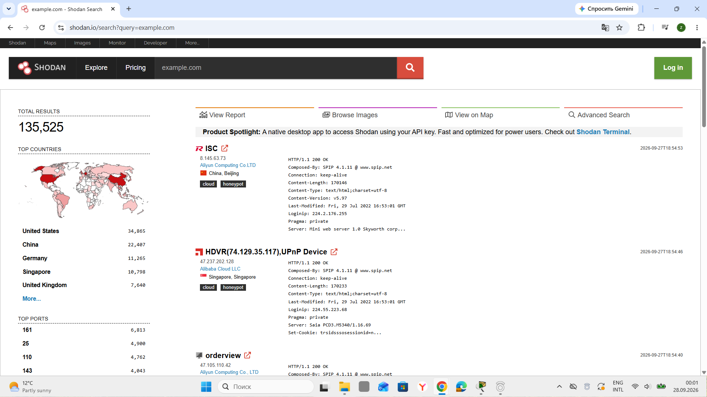
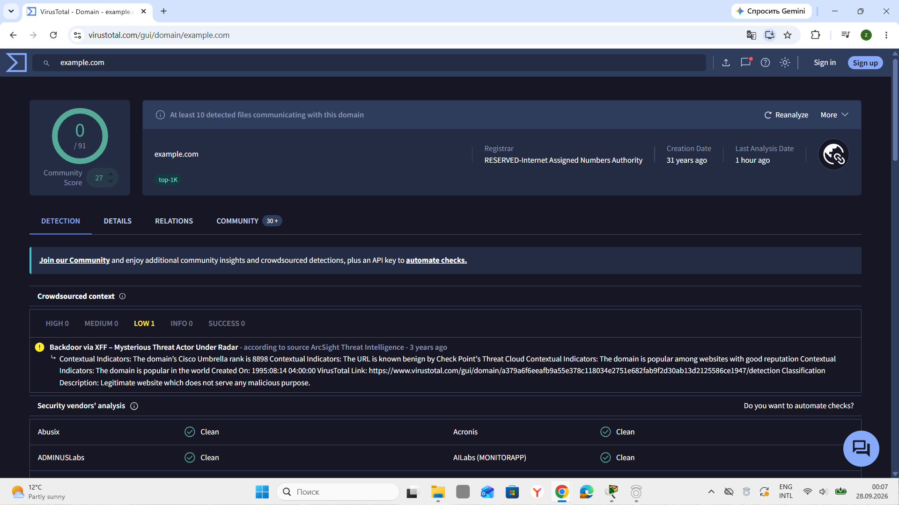
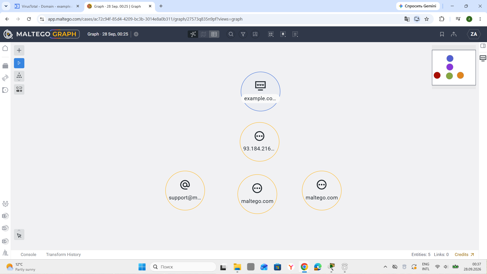
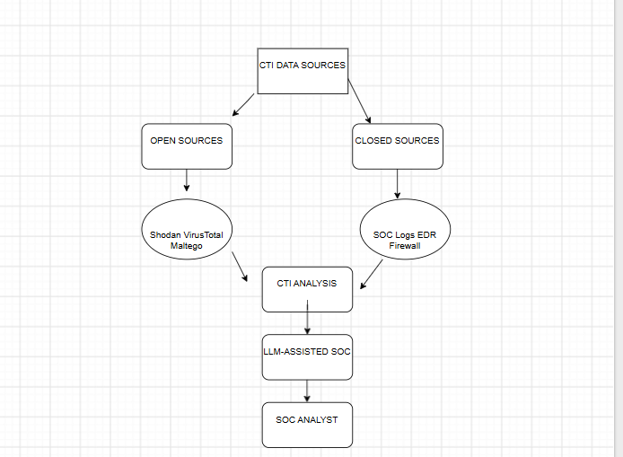

# Week 2 — Data Collection and OSINT

## 1. Objective

The objective of Week 2 was to study the data collection process in Cyber Threat Intelligence (CTI) and practice Open-Source Intelligence (OSINT) techniques.

During this week, our group studied the difference between open-source and closed-source data, explored OSINT resources, and performed practical data collection using Shodan, VirusTotal, and Maltego.

The practical activities were connected to our group project, **The Use of Large Language Models in Security Operations Centers (SOC)**. The main idea of our project is to investigate how Large Language Models (LLMs) can support SOC analysts in processing, summarizing, correlating, and explaining cybersecurity information.

The information collected from OSINT sources can provide additional context for security alerts and can later be combined with internal SOC data for further analysis.

---

## 2. Data Collection Process

Cyber Threat Intelligence requires collecting information from different sources before it can be analyzed and used for security decisions.

A basic data collection process can be represented as follows:

```text
Intelligence Question
        ↓
Identify Required Data
        ↓
Select Data Sources
        ↓
Collect Data
        ↓
Validate and Organize Data
        ↓
Analyze and Correlate Data
        ↓
Generate Cyber Threat Intelligence
        ↓
Support SOC Investigation
```

The first step is to define what information is needed. For example, a SOC analyst may need information about a suspicious domain, IP address, URL, file hash, or network infrastructure.

After identifying the required information, the analyst selects appropriate data sources. These sources can include public OSINT platforms, threat intelligence databases, security reports, and internal security systems.

The collected information should then be checked and organized before analysis. Different sources may provide different types of information about the same indicator. Combining these sources can give the analyst a more complete view of the situation.

For our project, this process is important because an LLM can later assist with organizing and summarizing collected information. However, the collected data should be validated and the final investigation decisions should remain under the control of a human SOC analyst.

---

## 3. Open-Source and Closed-Source Data

During Week 2, we compared open-source and closed-source data.

| Open-Source Data                                                                   | Closed-Source Data                                                      |
| ---------------------------------------------------------------------------------- | ----------------------------------------------------------------------- |
| Publicly accessible information                                                    | Restricted or private information                                       |
| Can be collected from public sources                                               | Usually requires authorization or internal access                       |
| Useful for external threat context                                                 | Useful for internal security investigations                             |
| Examples include OSINT reports, public databases, and public technical information | Examples include SOC logs, EDR data, firewall logs, and internal alerts |
| Usually easier to access                                                           | Access is controlled by an organization                                 |

Open-source data does not necessarily mean that the information is automatically reliable. Public information should still be checked and compared with other sources.

Closed-source data can provide information that is not publicly available, especially about an organization's own infrastructure and security events.

For an LLM-assisted SOC, both types of information can be useful. OSINT can provide external context, while internal SOC data can show what is happening inside an organization.

---

## 4. OSINT Sources

### 4.1 OSINT Framework

OSINT Framework was reviewed as a resource for finding publicly available intelligence sources.

The framework organizes different OSINT resources into categories. It can help an analyst identify which public source may be useful for a specific investigation.

For example, an analyst investigating a domain or IP address can use OSINT resources to search for technical, network, domain, or other publicly available information.

**Figure 1. OSINT Framework**



The OSINT Framework was useful for understanding that OSINT is not one single tool. Instead, it is a collection of different sources and techniques that can be used depending on the intelligence question.

---

### 4.2 SANS

SANS resources were also reviewed as part of the Week 2 OSINT research.

SANS provides cybersecurity education and security research materials. Its resources can be used to understand cybersecurity concepts, investigation methods, and security practices.

**Figure 2. SANS OSINT Resource**



SANS materials are useful as a supporting knowledge source because they provide cybersecurity-related information that can help analysts understand and interpret collected data.

---

## 5. Practical OSINT Data Collection

According to the Week 2 task, practical OSINT data collection was performed using:

* Shodan;
* VirusTotal;
* Maltego.

For the practical investigation, we used **example.com** as a safe educational domain.

The purpose was not to investigate a real malicious target, but to demonstrate how different OSINT tools can provide different types of information about a publicly known domain.

---

### Collected observations and evidence scope

The intelligence question was: what context do the selected tools display for the benign domain `example.com`, and which claims can the observations support?

The screenshot observations are recorded in [`data/osint-observations.csv`](data/osint-observations.csv). Dates are taken from the taskbar visible in the original captures (27-28 September 2026); they are not asserted as exact UTC collection timestamps. The separate [`data/source-mapping.csv`](data/source-mapping.csv) maps input, output, access, analytical use and reliability limits. Internal SOC sources are explicitly planned rather than collected.

| Tool | What is evidenced | What is not evidenced |
|---|---|---|
| Shodan | Broad text search and aggregate result count | Ownership of returned hosts by the domain |
| VirusTotal | Displayed domain context and historical 0/91 vendor detections | Guaranteed safety or a current verdict |
| Maltego | Five manually entered nodes in the interface | Automated transforms, verified entity types or links |

The Maltego component is an introductory manual demonstration. Stronger practical evidence would be an exported graph with sourced links and transform results; those outputs were not present in the repository and have not been invented during this audit.

## 6. Shodan

Shodan was used to explore publicly available information about Internet-connected infrastructure.

For the practical demonstration, we searched for:

```text
example.com
```

The search returned hosts and services matching a broad text query. It did not establish that those hosts belonged to `example.com`.

The Shodan results included information such as:

* total number of search results;
* countries;
* open ports;
* IP addresses;
* available services;
* HTTP-related information.

**Figure 3. Shodan Search**



The captured search shows 135,525 results. This is a historical observation from the screenshot, not a current count or a list of systems belonging to the domain. A broad text match can occur in banners unrelated to domain ownership. These results should not be interpreted as evidence that the listed IP addresses are malicious.

The purpose of this activity was to understand what type of infrastructure-level information can be obtained through a public search engine such as Shodan.

From a CTI perspective, this information can help an analyst understand the external infrastructure associated with an indicator or investigate the possible attack surface of an organization.

For our LLM-assisted SOC project, Shodan data can provide additional external context for an alert. For example, if a SOC alert contains an IP address, information about ports and services can help the analyst understand what type of infrastructure is associated with that address.

---

## 7. VirusTotal

VirusTotal was used to investigate the domain:

```text
example.com
```

The VirusTotal result showed:

* `0/91` detections;
* the domain name `example.com`;
* registrar information;
* creation date information;
* a recent analysis date;
* community information;
* Detection, Details, Relations, and Community sections.

**Figure 4. VirusTotal Search**



The result did not indicate that the domain was malicious. VirusTotal showed `0/91` detections in the displayed analysis.

This result is important because it demonstrates that an OSINT tool can also provide evidence that an indicator is not currently identified as malicious by the available detection sources.

The result should still be interpreted carefully. A zero-detection result does not prove that an indicator can never be associated with malicious activity. It only describes the result available from the analyzed sources at that time.

For our project, VirusTotal is relevant because a SOC analyst can use threat intelligence information to add context to an alert. An LLM could later help summarize this information and present the relevant findings to the analyst in a more understandable form.

---

## 8. Maltego

**Update, 9 October 2026:** [The DNS supplement](dns-supplement.md) adds six relationships supported by actual resolver answers, timestamps and source hashes. They were collected independently of the Maltego client. The historical screenshot below still does not establish completed transforms; new client execution evidence remains pending.

Maltego was used to demonstrate manual entity entry. The captured graph shows `Entities: 5` and `Links: 0`; it demonstrates the interface and nodes, but does not establish verified relationships or successful automated transforms.

For the practical activity, we used:

```text
example.com
```

The report originally described the intended entity categories as follows. The screenshot truncates several labels and does not independently verify their full values or types:

* IPv4 Address;
* DNS Name;
* MX Record;
* NS Record.

**Figure 5. Maltego Investigation Graph**



The entities represent different types of technical information that can be considered during an investigation.

An **IPv4 Address** represents an IP address associated with network infrastructure.

A **DNS Name** represents domain name information.

An **MX Record** is related to mail exchange infrastructure.

An **NS Record** represents name server information.

The entities were added manually for the purpose of demonstrating the types of information that can be considered during an OSINT investigation. The visible `93.184.216...` label is not treated as a verified current DNS result. The two `maltego.com` nodes and truncated email label must not be reported as infrastructure belonging to `example.com` without evidence.

The main purpose of this activity was to understand the concept of relationship-based investigation. In a real investigation, Maltego can be used to explore relationships between different entities and visualize information that may otherwise be difficult to understand when viewed separately.

This is relevant to our project because an LLM-assisted SOC can potentially use structured investigation data to summarize relationships between indicators and provide additional context to a SOC analyst.

The LLM should support the analyst's investigation rather than replace human verification.

---

## 9. Comparison of OSINT Tools

The three tools used during the practical part of Week 2 have different purposes.

| Tool       | Main Purpose                             | Example Information                    | Role in CTI            |
| ---------- | ---------------------------------------- | -------------------------------------- | ---------------------- |
| Shodan     | Internet-facing infrastructure discovery | IP addresses, ports, services, banners | Infrastructure context |
| VirusTotal | Indicator investigation                  | Domains, IPs, URLs, hashes, detections | Indicator context      |
| Maltego    | Relationship and entity visualization    | Domains, IPs, DNS and other entities   | Relationship analysis  |

Using multiple sources can provide a broader view of an indicator.

For example, Shodan can provide infrastructure information, VirusTotal can provide security-analysis information, and Maltego can help organize relationships between technical entities.

This demonstrates why CTI data collection often uses several sources rather than relying on a single platform.

---

## 10. Data Source Mapping

A data source mapping was developed to show what information can be collected from different sources and how it can support our project.

| Data Source     | Type                       | Data Collected                                   | Main Use                      | Project Role                    |
| --------------- | -------------------------- | ------------------------------------------------ | ----------------------------- | ------------------------------- |
| OSINT Framework | Open source                | Public OSINT resources                           | Finding useful sources        | Source discovery                |
| SANS            | Open source                | Cybersecurity research and educational materials | Research and methodology      | CTI knowledge                   |
| Shodan          | Public OSINT               | IPs, ports, services, banners                    | Infrastructure investigation  | External infrastructure context |
| VirusTotal      | Public/commercial platform | Domains, IPs, URLs, hashes, detections           | Indicator investigation       | IOC context                     |
| Maltego         | OSINT platform             | Entities and relationships                       | Correlation and visualization | Relationship analysis           |
| SOC Logs        | Closed source              | Events, timestamps, users, IPs                   | Internal investigation        | Internal security context       |
| EDR Data        | Closed source              | Endpoint events and detections                   | Endpoint investigation        | Internal threat evidence        |
| Firewall Logs   | Closed source              | Network connections and traffic information      | Network investigation         | Internal network context        |

The mapping shows that different sources provide different types of information.

Public OSINT sources can provide information about external infrastructure and known indicators. Internal sources can provide information about events occurring inside an organization.

Combining both types of information can provide more context for SOC investigations.

---

## 11. Data Source Mapping Diagram

The relationship between the sources can be represented as follows:

```text
                    CTI / OSINT DATA
                           |
        -----------------------------------------
        |                 |                     |
        ↓                 ↓                     ↓
   OSINT Framework      SANS                OSINT Tools
                                              |
                              -------------------------------
                              |              |              |
                              ↓              ↓              ↓
                           Shodan       VirusTotal       Maltego
                              |              |              |
                              -------------------------------
                                             |
                                             ↓
                                  External CTI Context
                                             |
                                             ↓
                                      SOC Investigation
                                             |
                         -----------------------------------
                         |                                 |
                         ↓                                 ↓
                    SOC Logs                            EDR Data
                         |                                 |
                         ----------- Firewall Logs ----------
                                             |
                                             ↓
                                  Combined Security Data
                                             |
                                             ↓
                                    LLM-Assisted Analysis
                                             |
                                             ↓
                                      SOC Analyst
                                             |
                                             ↓
                                  Final Investigation
```

**Figure 6. Data Source Mapping**



The diagram demonstrates how information from different sources can eventually be combined for security analysis.

The LLM is placed after the data collection and organization stages because the model should analyze information that has already been collected and prepared.

The final stage remains with the SOC analyst, who verifies the results and makes the final investigation or response decision.

---

## 12. Connection to the LLM-Assisted SOC Project

The Week 2 activities are directly connected to our trimester project.

Our project focuses on the use of Large Language Models in Security Operations Centers. An LLM cannot provide useful security analysis without relevant input data.

The OSINT tools used during Week 2 demonstrate several possible sources of external cybersecurity information.

The general workflow can be represented as:

```text
SOC Alert
     ↓
Extract Indicator
     ↓
OSINT Data Collection
     ↓
Shodan / VirusTotal / Maltego
     ↓
Collect External Context
     ↓
Combine with Internal SOC Data
     ↓
Organize and Process Data
     ↓
LLM-Assisted Analysis
     ↓
Analyst Verification
     ↓
Investigation / Response
```

For example, if a SOC alert contains an IP address or domain, an analyst can investigate the indicator using external CTI sources.

The collected information may include infrastructure details, detection information, and relationships between technical entities.

An LLM can then potentially assist with:

* summarizing large amounts of collected information;
* explaining technical findings in simpler language;
* identifying relationships between pieces of information;
* organizing investigation notes;
* helping an analyst formulate additional investigation questions;
* supporting prioritization of information for human review.

However, the LLM should not be treated as the final source of truth. Security information should be verified using reliable sources and technical evidence.

---

## 13. Ethical and Legal Considerations

OSINT collection should be performed responsibly and within legal and ethical boundaries.

During our practical work, we used `example.com` as a safe educational domain rather than targeting a real organization.

The purpose of the activity was to learn how public cybersecurity information can be collected and interpreted.

When using OSINT tools, analysts should:

* use information that is publicly available;
* respect applicable laws and regulations;
* avoid unauthorized access to systems;
* avoid attempting to exploit discovered services;
* avoid collecting unnecessary personal information;
* verify information before making security conclusions;
* document the source and context of collected information.

These principles are especially important when OSINT data is later processed by an LLM because sensitive or unnecessary information should not be provided to an AI system without appropriate authorization and security controls.

---

## 14. Recommended Reading

One of the recommended resources for Week 2 was Michael Bazzell's book:

**Bazzell, M. — Open Source Intelligence Techniques.**

This resource provides practical information about OSINT methods and demonstrates how publicly available information can be collected and analyzed.

The book is a recommended resource; the repository does not contain reading notes demonstrating that it was completed. The [publisher's book page](https://inteltechniques.com/book1) was checked during the audit. Source selection, provenance and verification remain the methodology used in this report.

---

## 15. Week 2 Results

During Week 2, our group completed the following activities:

* studied the CTI data collection process;
* compared open-source and closed-source data;
* reviewed the OSINT Framework;
* reviewed SANS cybersecurity and OSINT-related resources;
* performed practical OSINT collection using Shodan;
* investigated `example.com` using VirusTotal;
* examined the available VirusTotal detection and community information;
* created a Maltego graph using manually added technical entities;
* added a later live DNS collection of six verified relationships, with raw answers and provenance in the supplement;
* studied the purposes of Shodan, VirusTotal, and Maltego;
* developed a data source mapping;
* connected OSINT data collection with our LLM-assisted SOC project;
* considered ethical and legal aspects of OSINT collection.

The main result of Week 2 was a better understanding of where cybersecurity information can be collected and how different sources can provide different types of context for a SOC investigation.

---

## 16. Conclusion

Week 2 focused on the collection of cybersecurity information using OSINT methods.

The practical activities demonstrated that different tools provide different types of information. Shodan can provide infrastructure-related information, VirusTotal can provide information about indicators and detections, and Maltego can be used to organize technical entities and investigate relationships.

The data source mapping showed how public OSINT sources can be combined with internal SOC sources such as logs, EDR data, and firewall information.

This work provides the foundation for the next stage of our project. After collecting and organizing cybersecurity data, the next step is to study how this information can be processed and analyzed with the support of Large Language Models in a SOC environment.

The main concept of our project remains:

```text
DATA COLLECTION
       ↓
DATA PROCESSING
       ↓
LLM / AI ASSISTANCE
       ↓
THREAT ANALYSIS
       ↓
SOC ANALYST
       ↓
FINAL DECISION
```

The LLM is considered an assistance tool for the SOC analyst, while human verification and decision-making remain essential.

---

## References

1. SANS Institute. [What is Open-Source Intelligence?](https://www.sans.org/blog/what-is-open-source-intelligence/).

2. [OSINT Framework](https://osintframework.com/).

3. Shodan. [Search query used in the screenshot](https://www.shodan.io/search?query=example.com). Results may change.

4. VirusTotal. [example.com domain page](https://www.virustotal.com/gui/domain/example.com). Results may change.

5. Maltego. [Official product site](https://www.maltego.com/). The screenshot provides the evidence for the manual graph.

6. Bazzell, M. [OSINT Techniques: Resources for Uncovering Online Information](https://inteltechniques.com/book1), publisher information; recommended reading rather than a claimed completed exercise.
