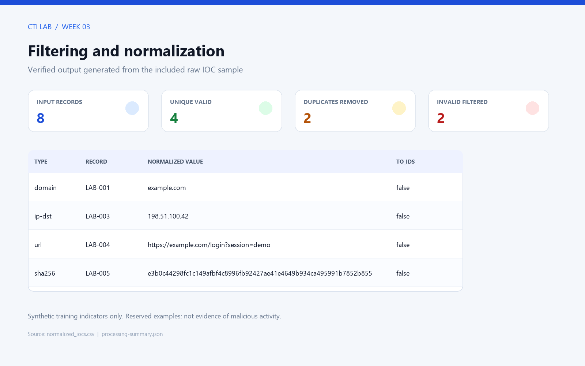
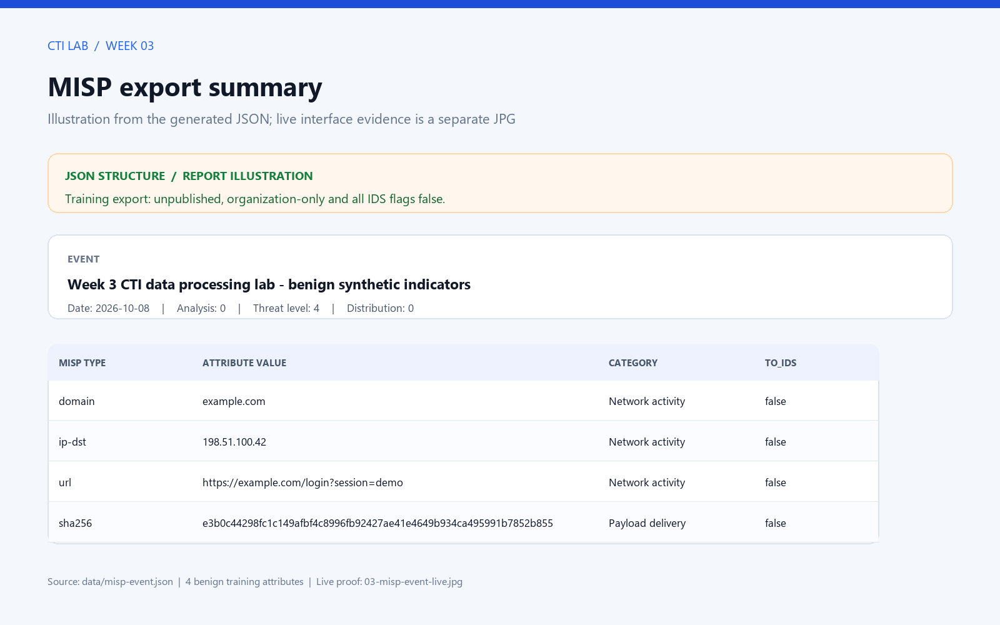
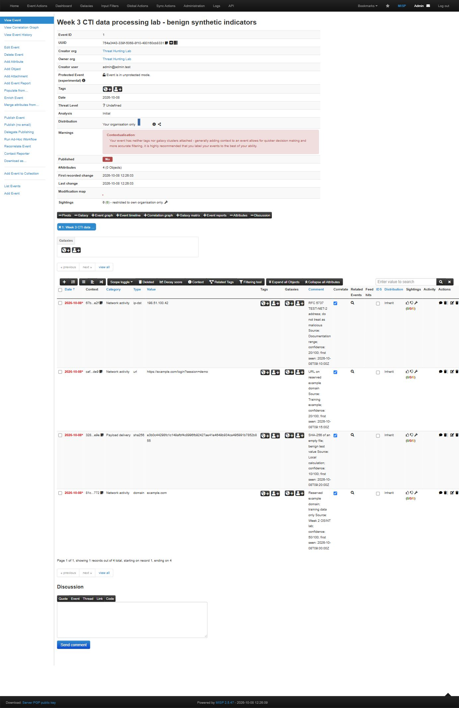

# Week 3 — Data Processing and Exploitation

**Project:** The Use of Large Language Models in Security Operations Centers (SOC)

**Group:** CS-2423

## 1. Objective

Week 3 focused on transforming collected cyber threat data into consistent, usable intelligence. The syllabus covers data enrichment and correlation, with MISP, Elastic Stack, and Sigma as supporting tools. The practical tasks are to import indicators into MISP and apply filtering and normalization to collected data.

This lab demonstrates that workflow with a small, synthetic indicator set. It validates and normalizes domains, IPv4 addresses, URLs, and SHA-256 hashes; removes duplicates and malformed values; and exports the result as a MISP-compatible event. The indicators are deliberately benign training values.

The Week 2 screenshots are separate historical OSINT observations. This eight-row sample was constructed for testing; its timestamps and confidence values are synthetic exercise metadata. A source label such as `Week 2 OSINT lab` explains the domain example's context, not an automatic export from those tools or a measured threat confidence.

## 2. Processing workflow

```text
Raw IOC records
      ↓
Validate type and syntax
      ↓
Normalize case and representation
      ↓
Filter invalid values and duplicates
      ↓
Add provenance and confidence
      ↓
Export normalized CSV and MISP event JSON
      ↓
Map fields for SIEM use and create a Sigma example
      ↓
Analyst review
```

Processing before analysis matters because the same indicator may arrive with different capitalization, whitespace, or punctuation. Invalid values and duplicate records can inflate counts, create noisy searches, or make downstream correlation less reliable. A normalized record should also keep its source and context so that an analyst can check where it came from.

## 3. Safe test data

The input file is [`data/raw_iocs.csv`](data/raw_iocs.csv). It contains eight records:

| Type | Example | Purpose |
|---|---|---|
| Domain | ` Example.COM. ` | Test whitespace, uppercase, and trailing-dot normalization |
| IPv4 | `198.51.100.42` | Documentation-only address from TEST-NET-2 |
| URL | `HTTPS://Example.COM/login?session=demo#top` | Test URL case and fragment normalization |
| SHA-256 | `e3b0c442...b855` | SHA-256 of an empty file; benign test value |
| Invalid IPv4 | `999.10.10.5` | Test validation and filtering |
| Invalid domain | `bad..domain` | Test syntax validation and filtering |

The domain is `example.com`, reserved for documentation. The IPv4 address belongs to a documentation range. The hash is the known digest of an empty file. These values are not presented as malicious indicators and must not be used to block traffic.

## 4. Filtering and normalization

The processor in [`process_iocs.py`](process_iocs.py) applies these rules:

| Indicator type | Validation and normalization |
|---|---|
| Domain | Trim whitespace, lowercase, remove a final dot, and reject malformed labels |
| IPv4 destination | Parse with an IP address library, require IPv4, and write canonical dotted-decimal notation |
| URL | Require an absolute HTTP(S) URL, lowercase scheme and host, remove a default port and fragment, and preserve path and query |
| SHA-256 | Require exactly 64 hexadecimal characters and lowercase the digest |

Records are deduplicated on the pair `(type, normalized value)`. A duplicate does not create another MISP attribute. The first valid record retains its source, first-seen timestamp, confidence, and explanatory note; the summary also retains duplicate record IDs, their source, observation time and the retained record ID. Invalid rows are recorded with a reason. Metadata validation requires a source, a record ID, an explicit timestamp timezone and a confidence value between 0 and 100, or a blank confidence when it was not assessed.

Run the processor from the repository root:

```powershell
python .\week3\process_iocs.py
```

It writes [`data/normalized_iocs.csv`](data/normalized_iocs.csv), [`data/misp-event.json`](data/misp-event.json), and [`data/processing-summary.json`](data/processing-summary.json). It checks that the row counts reconcile. The test suite checks the included sample totals separately, so an alternative input is not rejected merely for having a different count. The event date defaults to the latest accepted input observation date rather than the day the script is rerun. See [the reproduction guide](lab-reproduction.md) for CLI options and supported input types.

## 5. Results

| Processing result | Count |
|---|---:|
| Raw records | 8 |
| Valid unique indicators | 4 |
| Duplicate records removed | 2 |
| Invalid records filtered | 2 |

The four retained indicators are one domain, one IPv4 address, one URL, and one SHA-256 hash. The processor reports the invalid IPv4 and malformed domain as rejected records. The output files preserve the provenance and context required for review.

### Processing the actually collected domain

To connect the exercise to collected data, the domain visible in the retained VirusTotal screenshot was transcribed into [`../week2/data/collected-indicators.csv`](../week2/data/collected-indicators.csv). It was processed with:

```powershell
python week3/process_iocs.py --input week2/data/collected-indicators.csv --output-dir week3/data/collected
```

The [collected-data summary](data/collected/processing-summary.json) records one input and one retained domain, with zero invalid or duplicate records. Its [normalized CSV](data/collected/normalized_iocs.csv) and [separate JSON export](data/collected/misp-event.json) are saved. `first_seen` is explicitly the time the screenshot-derived record entered this dataset during the audit; the screenshot's exact original timestamp is unknown. Confidence is blank rather than invented. This second export was not imported into MISP; Event 1 remains the four-attribute synthetic training event.

### Evidence images

Figures 1 and 2 are rendered from the verified processing output and the imported event data. They are report illustrations. Figure 3 is an actual full-page screenshot of the local MISP event view, saved in the project so it is available with the report and ZIP archive.



*Figure 1. Four valid unique indicators retained; two duplicates and two invalid records filtered.*



*Figure 2. Illustration of the generated MISP JSON with four training attributes and `to_ids=false`. The actual imported state is evidenced by Figure 3.*



*Figure 3. Actual MISP interface showing Event ID 1, four attributes, organization-only distribution, Published: No, and all four IDS flags unchecked. This confirms the current imported state; it is not a screenshot of the original import success message.*

## 6. MISP event preparation

The generated [`data/misp-event.json`](data/misp-event.json) follows the MISP event JSON structure and contains one event with four attributes. Attributes use the MISP types `domain`, `ip-dst`, `url`, and `sha256`. The event and attributes have stable UUIDs so the same training event can be identified consistently.

Every attribute has `to_ids` set to `false`. Since these are benign examples, the event is classified as an initial analysis with an undefined threat level, is unpublished and is limited to the local organization. These flags express its training status and IDS eligibility; they are not a reputation verdict.

The event was imported through the already-running local course MISP lab using the MISP JSON import workflow. MISP returned `OK — Event created` and assigned Event ID 1. The event page showed four attributes, `Published: No`, distribution limited to the organization, and all four IDS flags turned off. The live event view is saved as [`images/03-misp-event-live.jpg`](images/03-misp-event-live.jpg). MISP's [core format documentation](https://misp.github.io/misp-website/datamodels/) describes the JSON format used for event and attribute exchange.

## 7. Enrichment, correlation, and SIEM mapping

Data processing prepares information for enrichment and correlation; it does not prove that an indicator is malicious. During the audit, [`enrich_correlate.py`](enrich_correlate.py) was executed and saved [`data/enrichment-correlation.json`](data/enrichment-correlation.json): four records with training context and one explicit relationship from URL record LAB-004 to hostname record LAB-001. Context uses the reviewed IANA documentation, RFC 5737 range classification and a local calculation of the empty-file hash. The relationship is derived by exact URL hostname equality. This is a local demonstration, not a reputation API lookup or a multi-event MISP correlation. In a real investigation, independent sightings and related incident evidence would be needed.

| Normalized field | Example | MISP / SIEM use |
|---|---|---|
| `type` | `domain` | MISP attribute type; maps to an indicator type field in the SIEM |
| `value` | `example.com` | MISP attribute value; normalized observable value for correlation |
| `source` | `Week 2 OSINT lab` | Provenance for analyst review |
| `first_seen` | ISO 8601 UTC timestamp | Observation time for timelines and correlation |
| `confidence` | `50` | Context for prioritization, not a verdict |
| `to_ids` | `false` | Prevents these benign test attributes from driving detection |
| `context` | `Reserved example domain; training data only` | Explains the value and its limitations |

In an Elastic Stack workflow, these fields can be mapped to the organization's chosen threat-intelligence schema and ECS fields. Field mapping should be explicit so that comparisons do not silently mix domains, URLs, IPs, and hashes. Elastic's [ECS reference](https://www.elastic.co/guide/en/ecs/current/ecs-threat.html) documents threat-related fields. The table is a design reference; no Elastic ingestion or query is claimed.

## 8. Sigma example

[`sigma/example_domain_connection.yml`](sigma/example_domain_connection.yml) is a test-level Sigma rule for a Sysmon network-connection event whose `DestinationHostname` is `example.com`. It demonstrates how a normalized observable can be used in a detection rule. It is intentionally scoped to a reserved benign domain and reports informational severity; it is not a production block rule. The rule requires compatible Sysmon network events and field mapping in the target SIEM. Sigma's [rule specification](https://sigmahq.io/sigma-specification/specification/sigma-rules-specification.html) defines the interoperable YAML structure.

The rule was parsed successfully with official SigmaHQ pySigma 2.0.0 during the audit. The reproducible validator is [`../tools/validate_sigma.py`](../tools/validate_sigma.py); [`data/sigma-validation.json`](data/sigma-validation.json) records the result and explicitly states that SIEM execution and detection effectiveness were not measured. Syntax validation is additional evidence, not a live detection test.

## 9. Connection to the LLM-assisted SOC project

An LLM could help an analyst summarize a set of normalized indicators, group records by type or source, explain why a row was filtered, and draft a short correlation summary. For example, it can explain that `Example.COM.` and `example.com` normalize to the same domain, while an invalid IP cannot be used for reliable lookup.

The model should receive the source, timestamps, confidence, and the fact that these are benign training indicators. It should not turn a formatting match into a threat verdict. Validation, enrichment quality, detection choices, and response actions remain subject to analyst review.

## 10. Limitations and verification

The processing, export and local enrichment steps are reproducible from the included CSV and Python scripts. Ingestion into the existing local MISP lab was confirmed by its import result and the event view. Seven normalization/metadata/reproducibility tests and the official Sigma parser passed. A query against a running Elastic Stack and execution of the Sigma rule in a SIEM were not performed. The [lab guide](lab-reproduction.md) documents the running-container evidence and the reviewed MISP training sections.

The input set is intentionally tiny and synthetic. It demonstrates data quality controls and format conversion; it does not measure detection effectiveness, source reliability, or real-world threat activity. A production workflow would require access control, sharing-policy review, source validation, expiry and sighting handling, and testing against the target platform's field mappings.

## 11. Week 3 results

- Defined a repeatable pipeline from raw indicators to normalized intelligence.
- Validated domains, IPv4 addresses, URLs, and SHA-256 values.
- Removed two malformed records and two duplicates from the sample.
- Preserved provenance, timestamps, confidence, and context for accepted indicators.
- Imported MISP Event 1 with four benign attributes, all with `to_ids=false`; the event remains unpublished and organization-only.
- Executed a local enrichment and URL-host correlation demonstration with four records and one relationship.
- Parsed the informational Sigma example with official pySigma and included a field-mapping reference for SIEM use; the rule was not executed against a SIEM.
- Confirmed MISP ingestion; documented Elastic querying and Sigma execution as unverified.

## 12. Conclusion

Week 3 showed how CTI data becomes more useful when it is validated, normalized, deduplicated, and kept with its provenance. The sample pipeline produced four unique, syntactically valid indicators from eight input records and exported them in a MISP-compatible structure. The accompanying Sigma file illustrates how normalized observables can support SIEM detection logic. In an LLM-assisted SOC, these prepared records provide structured input for summarization and correlation, while human analysts remain responsible for confirming intelligence and deciding how to respond.

## References

1. Astana IT University. *Introduction to Threat Hunting Syllabus, Academic Year 2026–2027*, Week 3: Data Processing and Exploitation.
2. MISP Project. [MISP data models and core format](https://misp.github.io/misp-website/datamodels/).
3. MISP Project. [MISP training materials](https://www.misp-project.org/misp-training/).
4. Elastic. [ECS threat fields](https://www.elastic.co/guide/en/ecs/current/ecs-threat.html).
5. Sigma. [Sigma Rules Specification](https://sigmahq.io/sigma-specification/specification/sigma-rules-specification.html).
6. IANA. [Example Domains](https://www.iana.org/help/example-domains).
7. IETF. [RFC 5737: IPv4 Address Blocks Reserved for Documentation](https://www.rfc-editor.org/rfc/rfc5737).
