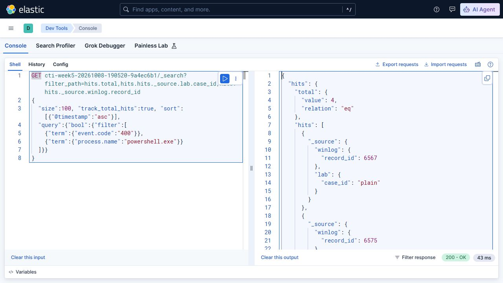
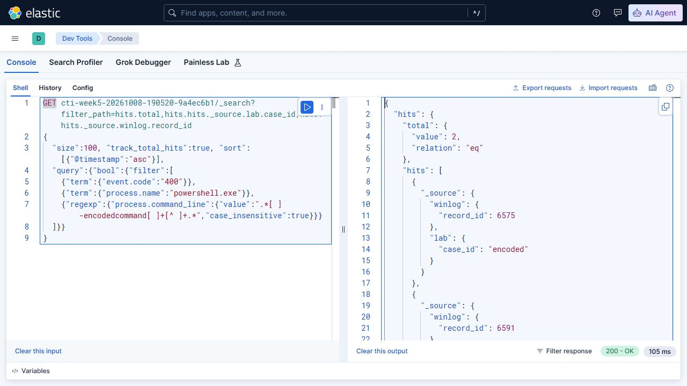
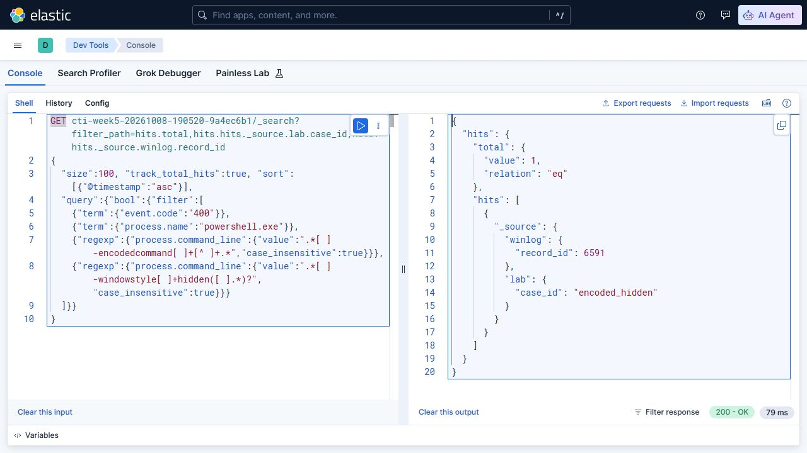

# Week 5 — Hypothesis-driven Threat Hunting

## 1. Assignment and hypothesis

The syllabus requires a hypothesis-driven hunting scenario and execution of hunt queries in Splunk or ELK. This exercise uses an existing local Elasticsearch and Kibana lab. Splunk was available but required an administrator login and reported an expired license, so the hunt was completed in Elastic.

**Hypothesis:** Windows PowerShell launches containing the full `-EncodedCommand` flag merit review; combining it with `-WindowStyle Hidden` narrows the review set. Neither flag, individually or together, proves malicious intent. [MITRE ATT&CK T1059.001](https://attack.mitre.org/techniques/T1059/001/) supplies the execution context, not a verdict about our lab cases.

The workflow was: define the hypothesis → generate benign controls → collect native events → ingest into a new index → query → inspect the payloads → evaluate the hypothesis and visibility gaps.

## 2. Controlled activity and genuine telemetry

[The collector](collect_lab_events.ps1) launched four Windows PowerShell processes. Each payload was only `Write-Output` followed by a unique training marker. No downloads, external connections, credential access or malware were part of these payloads. Child exit status and output were checked before publishing the data.

| Case | EncodedCommand argument | WindowStyle Hidden argument | Known outcome |
|---|---|---|---|
| `plain` | No | No | Benign marker printed |
| `encoded` | Yes | No | Benign marker printed |
| `hidden` | No | Yes | Benign marker printed |
| `encoded_hidden` | Yes | Yes | Benign marker printed |

All child windows were suppressed by the collector's `Start-Process -WindowStyle Hidden` launch option. The table and queries concern the arguments recorded in `HostApplication`, not whether a window was visible on screen. No execution-policy setting was changed.

Collection ran on **9 October 2026, 00:02:37–00:02:43 Asia/Qyzylorda (UTC+05:00)**, corresponding to 8 October 2026, 19:02:37–19:02:43 UTC. The final run ID is `2e6084ecb5404749a4413892fe32a9da`.

The data are four genuine **Event 400** engine-start records from the `Windows PowerShell` log. Selection required the actual child PID and exact launch interval; the collector also checked that each recorded command contained its executed payload or decoded to it. No event was fabricated to fill a missing record.

| Case | Native record ID | PID |
|---|---:|---:|
| `plain` | 6567 | 10292 |
| `encoded` | 6575 | 8720 |
| `hidden` | 6583 | 22840 |
| `encoded_hidden` | 6591 | 36600 |

The PID values above must agree with [the collection manifest](data/collection-manifest.json), which also preserves UTC timestamps, checked outputs and original XML hashes. See [Microsoft's logging documentation](https://learn.microsoft.com/en-us/powershell/module/microsoft.powershell.core/about/about_logging?view=powershell-5.1) for the distinction between engine lifecycle and other PowerShell logging.

Public evidence:

- [Native XML with disclosed redactions](data/windows-events.xml).
- [Derived JSON Lines for indexing](data/powershell-events.jsonl).
- [Collection manifest and hashes](data/collection-manifest.json).

Only these controlled processes were exported. The published XML replaces the machine name with `CTI-LAB-HOST` and the user SID with `S-1-0-0` when present. Original XML and child output remain outside the repository. The redacted XML is not labelled an untouched EVTX export.

## 3. Actual Elastic execution

Existing training containers were restarted. Elasticsearch and Kibana were both **9.5.5**; [the runtime snapshot](evidence/live-run/runtime.json) records the version source and loopback host bindings `127.0.0.1:9200` and `127.0.0.1:5601`. Their existing authentication configuration was not changed. This is a local course lab, not a public deployment.

[The runner](run_hunt.py) created the new index `cti-week5-20261008-190520-9a4ec6b1`, explicitly mapped `process.command_line` as a `keyword`, ingested four documents with their native record IDs, and created Kibana data view `19d7e1ee-62b3-470f-84a8-9008b23acc6a`. It did not merge these events into another project's index.

The [complete API transcript](evidence/live-run/api-transcript.json) records requests, responses and HTTP status codes. [The saved hunt results](evidence/live-run/hunt-results.json) include the exact executed query bodies and dataset/query hashes. The status API did not expose the Kibana version in the initial result metadata; the subsequent runtime snapshot verified it from the running container's installed `package.json`.

## 4. Queries and results

The executable queries are in [hunt-queries.json](hunt-queries.json). [The Kibana Console requests](evidence/live-run/kibana-console.txt) can be pasted into Dev Tools. The searches filter Event 400 and `powershell.exe` before applying case-insensitive full-flag regular expressions. These are Elasticsearch Query DSL queries, not Splunk SPL or KQL.

| Search | Selection | Actual results | Cases |
|---|---|---:|---|
| `baseline` | PowerShell engine-start records in the exercise index | 4 | All four cases |
| `encoded` | Baseline plus full EncodedCommand argument | 2 | `encoded`, `encoded_hidden` |
| `encoded_hidden` | EncodedCommand plus WindowStyle Hidden argument | 1 | `encoded_hidden` |

The query selects candidates using the recorded command line. `lab.case_id` is used afterward to compare the result with known controls, not as a search condition. The runner rejects unexpected cases, indexing errors, timed-out searches or failed shards.

### Real Kibana screenshots

The same three searches were executed in the live Kibana Console. `filter_path` reduces the displayed response to counts, native record IDs and case labels; it does not change which events match. These JPEG files are actual interface captures.

**Baseline: four records**



**EncodedCommand: two records**



**EncodedCommand with Hidden: one record**



## 5. Analyst decision and limitations

Inspection and UTF-16LE Base64 decoding confirmed that the two encoded payloads only printed their assigned marker. **All four cases are benign.** The combination reduces the review set from four to one, but the remaining candidate is also benign. Calling it a detected infection would contradict the ground truth.

The hypothesis is useful as a limited triage question on these four controls. This exercise does not measure malware detection sensitivity, production precision, fleet baselines or evasion resistance. The queries deliberately recognize full flags and ordinary spaces; abbreviated flags, alternative hosts, unusual whitespace and flags embedded inside quoted payload text require more complete command-line parsing.

Event 400 shows engine startup and HostApplication. These collected events do not establish parent-process lineage, network destinations or the complete executed script blocks. Event 4104, Security 4688, Sysmon process/network records and a larger benign baseline would support a stronger follow-up hunt. They were not collected or claimed here.

The implementation uses Elasticsearch and Kibana with a custom collector and direct ingestion. Logstash, Winlogbeat and Elastic Security detection rules were not part of this run.

## 6. Reproduce

Python 3.10+ and a compatible existing local Elasticsearch/Kibana lab are required for replay:

```powershell
python week5/run_hunt.py --output-dir week5/evidence/my-replay
```

The output directory must be new or empty. Each replay creates a separate index and evidence folder; completed evidence is protected. `--resume` completes an interrupted run only when its acknowledged ingestion matches the archived dataset. It cannot replace completed results.

For a fresh native collection on Windows, use a different public output directory and keep private originals outside the repository:

```powershell
./week5/collect_lab_events.ps1 -OutputDirectory ../my-week5-events -PrivateDirectory ../my-week5-private
```

The runner currently replays the included dataset; to analyze a new collection, explicitly select and review a copy of that dataset in a separate checkout before running it. Do not overwrite the archived evidence to present another execution as the original run.

On this computer the existing containers can be started with `docker start threat-hunting-week5-elasticsearch-1 threat-hunting-week5-kibana-1`. Container images, account configuration and persistent volumes are not contained in the ZIP; this is not a claim of installation from a fresh machine.

## 7. Reading and references

The following specific documentation sections were checked while implementing the exercise; this is not a claim that the student completed an entire book or training guide:

1. [Microsoft: Windows PowerShell logging](https://learn.microsoft.com/en-us/powershell/module/microsoft.powershell.core/about/about_logging?view=powershell-5.1) — engine events and visibility limits.
2. [MITRE: PowerShell T1059.001](https://attack.mitre.org/techniques/T1059/001/) — execution context and why maliciousness requires additional evidence.
3. [Elastic: regexp query](https://www.elastic.co/docs/reference/query-languages/query-dsl/query-dsl-regexp-query) — keyword matching and case-insensitive option.
4. [Elastic: Kibana Console](https://www.elastic.co/docs/explore-analyze/query-filter/tools/console) — direct API request execution and response inspection.
5. [Elastic: create a data view](https://www.elastic.co/docs/api/doc/kibana/operation/operation-createdataviewdefaultw) — the data view used for this run.

The syllabus also recommends the Microsoft Threat Hunting Guide and Phillip Smith's Practical Threat Hunting. Their full reading is not documented in this repository.
